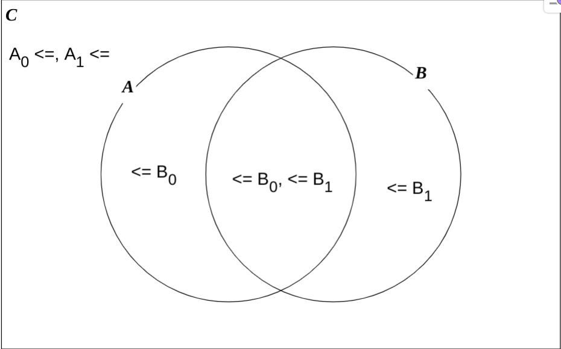

## Problem
Given an integer $N$ and $M$ pairs of integers. Each of pair contains two integers $A$ and $B$.

Your task is to find the number of ways to build an array $T$ such that:

$T_0 + T_1 + ... + T_{m-1} = N$  

and $A_i \leq T_i \leq B_i$.

Cause the answer can be very large, so it must be mod to $10^9 + 7$.

## Constraints
- $N \leq 10^6$
- $M \leq 16$
- $0 \leq A$, $A \leq B \leq N$

## Tutorial
### Subproblem 1
This is the extended version of *Euler's Candies Division*.  
Firstly, let's take a look at this subproblem:

$T_0 + T_1 + ... + T_{m-1} = N$  
 
and $A_i \leq T_i$.

$\Rightarrow T_i - A_i \geq 0$

Replace $P_i = T_i - A_i$ $(P_i \geq 0)$

$\Rightarrow P_0 + P_1 + ... + P_{m-1} = N - (A_0 + A_1 + ... + A_{m-1}) = X$

Now our problem looks similar to the basic problem *Euler's Candies Division*. And easily the answer is $C_{X + m - 1}^X$

### Subproblem 2
Now we some to solve $T_i \leq B_i$. Using *mathematical compensation*, let's consider there's just only one $i$ that has $B_i$, (call this position is $j$). 

Call $U = {(T_0, T_1, ..., T_{m-1})| \sum T = N,\  A_i \leq T_i\  \forall i \in [0, m-1] }$

Call $D = {(T_0, T_1, ..., T_{m-1})| \sum T = N,\  A_i \leq T_i\  \forall i \in [0, m-1], \exists j\ A_j = B_j + 1 }$

Easily, the answer is $U - D$.

### Final solution
We have solved the problem with only one $B_i$. For many $B_i$, we use *venn diagram*. Let's try to solve the above problem with two $B_i$. With *venn diagram*, 

we can logically see that the answer is $R_{even} - R_{odd}$, where $R_{even}$ is answer with an even number of $B_i$ and vice versa. 

Observantly that $M \leq 16$ so we can use **brute force** to check all state and using **Euler's phi** to calculate *combinatorial* due to the module value is a prime.

## Time complexity
$O(N + logN*2^M)$
